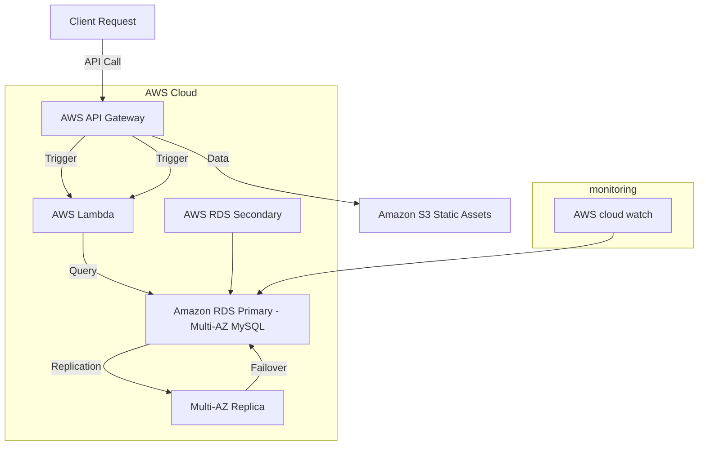

# LAB4

### High-Level Design (HLD) for Lift-and-Shift Migration to AWS

##### Solution Diagram

#### 1. Target Architecture Overview

The existing application consists of two virtual machines: WebServerVM hosting an API-based application and SQLVM hosting a MySQL database. In the new design, the application will be migrated to AWS, with WebServerVM refactored into a serverless architecture using **AWS Lambda**, and SQLVM's MySQL database replaced with **Amazon RDS** (Relational Database Service) featuring **multi-AZ replication** for high availability.

#### 2. Description of the Target Architecture

AWS managed services are utilized to achieve scalability and resilience with a low level of operational overhead. One of the biggest features of this new architecture is using **AWS Lambda** for serverless compute-to re-architecture API-based applications where management of the underlying infrastructure isn't required. Lambda will automatically scale if there is a spike in traffic, hence reducing the possibility of any experience of downtime during migration, and it saves on costs as Lambda consumes compute resources only when invoked. Amazon RDS, in conjunction with Multi-AZ replication, replaces MySQL on SQLVM. Assured database availability across availability zones, a higher level of fault tolerance, and automatic failover in case of failure of the primary database-all this will reduce downtime to less than 6 hours. Static content previously hosted on WebServerVM is now served via Amazon S3, providing a highly available and scalable file hosting solution at lower costs. AWS CloudWatch has been set up to monitor real-time Lambda performance, database health, and other vital components that affect the overall system uptime and reliability.

#### 3. Migration Steps

There are a number of important steps to be performed for the migration plan, with a view to ensuring scalability and resiliency while ensuring minimal downtime. The current API application running on WebServerVM needs to be refactored into discrete functions that are deployed using **AWS Lambda**. This gives the application serverless capabilities, while integration and configuration of **AWS API Gateway** are performed to route incoming requests to the appropriate Lambda functions. This guide migrates the MySQL database exported from SQLVM to an **Amazon RDS** instance configured with a **multi-AZ replication** for added fault tolerance. When required, **read replicas** can be set up for read-heavy traffic and seamless failover if the primary database fails. It also ensures high availability and redundancy with the **multi-AZ** failover mechanism for RDS. Further, appropriate alarms and monitoring will be set up through **AWS CloudWatch** for system health tracking and alerts in case of performance issues. In this approach, managed services-Lambda and RDS-are being used to simplify the operation, reduce the ongoing maintenance burden, and enable the architecture to scale dynamically with workload demand while assuring high availability.

#### Conclusion

This high-level design leverages AWS's cloud-native services to deliver an architecture that is scalable, highly available, and capable of reducing operational overhead. The combination of **AWS Lambda** and **Amazon RDS with multi-AZ replication** ensures that downtime is minimized, while **Amazon S3** and **CloudWatch** contribute to a reliable and efficient solution.

